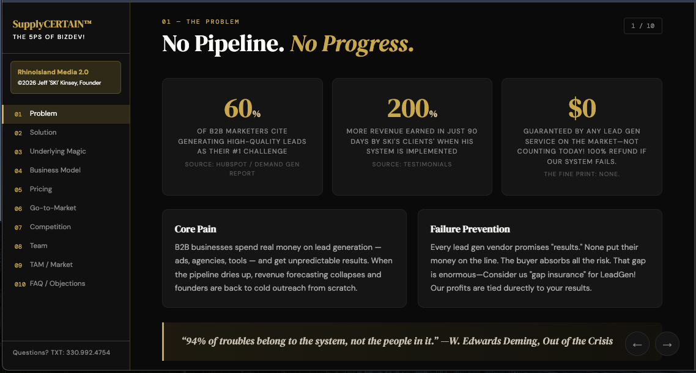

# SupplyCERTAIN
The Problem: B2B businesses spend real money on lead generation — ads, agencies, tools — and get unpredictable results. When the pipeline dries up, revenue forecasting collapses and founders are back to cold outreach from scratch.
